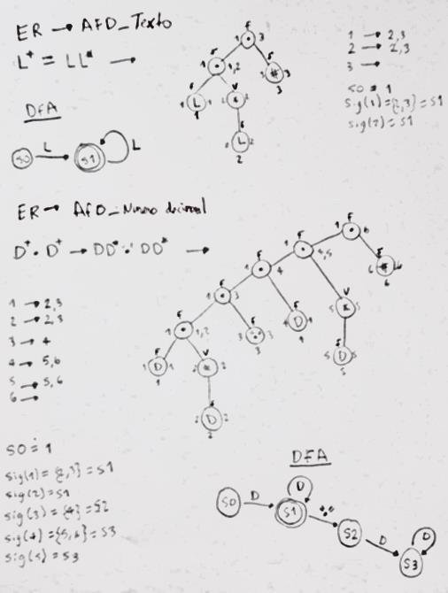



**Manual de Usuario** 

**Proyecto 2.** 

Nombre: Richard Alexandro Marroquín Arana Carné: 202102894 

Descripción de Proyecto 2: 

Programa de análisis de textos:  

Este es un proyecto desarrollado en el lenguaje de programación PYHTON con el cual se quiso satisfacer la necesidad de un sistema que reconociera instrucciones de ciertos reportes, teniendo en ellos operaciones aritméticas, así como instrucciones para la generación de reportes para la mejor comprensión de los datos calculados, así como la verificación de posibles errores en caracteres de los archivos cargados. Para ello se utilizaron distintos paradigmas de programación los cuales fueron: 

- POO (Programación orientada a objetos)  
- PF (Programación Funcional)  
- PI (Procedimientos iterativos) 

Métodos principales:  

Se fueron utilizados distintos métodos en la realización del proyecto como por ejemplo:  

- .read()  
- .strip()  
- .replace()  
- .lower()  
- .get()  
- .destroy() 
- .deiconify()  
- .place()  
- .insert()  
- .delete()  

Estructura del Proyecto 

Para la realización del programa, se realizó en 11 módulos. Estos módulos llevan por nombre 

- ventana.py (acá lleva la GUI del proyecto, además de la inserción de los tokens, errores y sentencias) 
- Funciones.py (en este módulo se encuentra el analizador léxico del programa, es con lo que genera las sentencias para mongoDB) 
- tabfunciones.py Como su nombre indica, en este módulo es donde pasa el archivo de entrada y es separado por Tokens, teniendo palabras claves y delimitadores para el proceso de creación 
- lexi.py Un analizador léxico es un programa que recibe como entrada el código fuente de otro programa y produce como salida una secuencia de tokens o componentes léxicos 
- listotokens.py lista de tokens es una secuencia de tokens o componentes léxicos que se obtiene como salida de un analizador léxico 
- sintac.py: analizador sintáctico es un programa que analiza una cadena de símbolos según las reglas de una gramática formal1. Estos símbolos suelen ser los tokens que se obtienen del analizador léxico2. El objetivo del analizador sintáctico es construir un árbol de análisis que represente la estructura sintáctica del programa 
- automata.py Un autómata finito es un modelo matemático para una máquina de estado finito, que recibe una cadena de símbolos y cambia de estado según una función de transición3. Por ejemplo: un semáforo, una cerradura electrónica, un analizador léxico. 

Listado de Tokens y Analizador Lexico 

` `

Método del árbol. 

