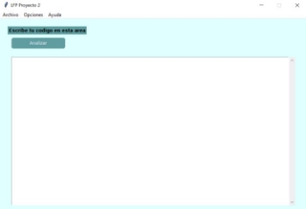
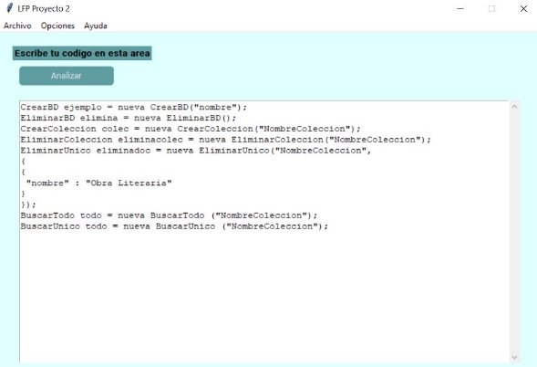



**Manual de Usuario** 

**Proyecto 2.**

Nombre: Richard Alexandro Marroquín Arana Carné: 202102894 

Definición 

Hola, bienvenido/a al manual de usuario de nuestra herramienta de diseño y creación de sentencias de bases de datos no relacionales. 

Nuestro proyecto consiste en una herramienta que te permitirá diseñar y crear sentencias de bases de datos no relacionales de una forma sencilla. Con esta aplicación, podrás trabajar en un área de edición de código y visualizar la sentencia final generada en un área de visualización. 

Una vez que tengas tus sentencias creadas, la herramienta realizará la compilación respectiva, lo que generará las sentencias de MongoDB. Estas sentencias serán mostradas en el espacio de resultados y posteriormente podrás aplicarlas a un entorno adecuado a MongoDB. 

Como mencionamos anteriormente, esta herramienta te permitirá trabajar con bases de datos no relacionales de una forma más sencilla. Específicamente, estamos hablando de la base de datos no relacional MongoDB, que es una de las más populares en el mercado. 

En el área de edición de código, podrás escribir tus sentencias de bases de datos no relacionales utilizando un lenguaje sencillo y fácil de entender. La herramienta te ofrecerá ayuda en tiempo real a través de sugerencias y autocompletado, lo que te ayudará a evitar errores y a escribir tus sentencias más rápidamente. 

En el área de visualización, podrás ver la sentencia final generada a medida que vas escribiendo el código. Esto te permitirá verificar que tu sentencia se está generando correctamente y hacer ajustes si es necesario. 

Una vez que tengas tus sentencias creadas, la herramienta realizará la compilación respectiva para generar las sentencias de MongoDB que serán mostradas en el espacio de resultados. Estas sentencias podrás utilizarlas posteriormente en un entorno adecuado a MongoDB, como una aplicación web o móvil, por ejemplo. 

Además, nuestra herramienta también cuenta con una sección de solución de problemas, donde podrás encontrar respuestas a las preguntas más comunes que pueden surgir durante el proceso de diseño y creación de sentencias de bases de datos no relacionales. 

Esperamos que nuestra herramienta te sea de gran ayuda en tus proyectos y que puedas aprovechar al máximo sus funcionalidades para diseñar y crear sentencias de bases de datos no relacionales de una forma más eficiente y sencilla. 

Funcionamiento 

Nuevo: Esta opción te permite limpiar el área de edición de código, donde puedes editar tus sentencias. Si tienes un archivo abierto, la herramienta te preguntará si deseas guardar los cambios antes de limpiar el editor. También se te preguntará el nombre del archivo y la ruta donde se guardará. 

Abrir: Con esta opción puedes abrir un archivo que ya hayas creado previamente y que contenga las sentencias que generan los comandos de MongoDB. Una vez cargado el archivo, podrás editarlo en el área de código. 

Guardar: Esta opción te permite guardar el código que estás escribiendo actualmente. 

Guardar Como: Con esta opción puedes guardar el código de las sentencias que estás editando con otro nombre. 

Salir: Con esta opción puedes cerrar la aplicación 

Menú Análisis: Este menú contiene la opción "Generar sentencias MongoDB", la cual analizará léxicamente y sintácticamente el contenido que esté en el área de código. Si existen errores, se mostrarán todos los errores encontrados tanto léxicos como sintácticos en el área de errores. Si no existen errores, la herramienta creará y mostrará las sentencias finales en sintaxis para MongoDB. 

Menú Tokens Ver: Este menú contiene la opción "Tokens", la cual muestra una tabla con todos los tokens que se reconocieron en el archivo de entrada. La tabla contiene información sobre el número correlativo de cada token, el tipo de token (por ejemplo, ID, número, etc.), el número de token, y el lexema. 

Área de errores: Esta sección está conformada por una tabla en la cual se cargan tanto los errores léxicos como los errores sintácticos después de compilar algún archivo. Para los errores, se deben mostrar el tipo de error (léxico o sintáctico), la línea en la que ocurrió el error, la posición del error (columna), el token o componente léxico que se esperaba, y una descripción del error. 

Tokens 

Tokens se refiere a una sección en la que se muestran los tokens que se han reconocido en el archivo de entrada. Los tokens son elementos básicos que se utilizan para construir las sentencias en el lenguaje de programación que se está utilizando, en este caso, las sentencias para MongoDB. 

En el área de Tokens, se muestra una tabla en la que se listan todos los tokens reconocidos, y se incluyen los siguientes datos: 

Numero correlativo: Se refiere a un número asignado a cada token en el orden en que se reconocieron en el archivo de entrada. Este número ayuda a identificar el orden en que se leyeron los tokens. 

Token: Este es el tipo de token que se reconoció. Por ejemplo, ID (para identificadores), Número (para números), etc. 

Numero de Token: Este es el número de veces que se ha encontrado el token. Es decir, si se encuentra el token "ID" varias veces en el archivo de entrada, se mostrará el número de veces que se encontró ese token. 

Lexema: Es la representación literal del token en el archivo de entrada. 

Errores 

Los errores léxicos se refieren a errores en la estructura de los tokens o elementos básicos que componen el código fuente. Por ejemplo, si se encuentra un carácter que no está permitido en un identificador, se considerará un error léxico. 

Por otro lado, los errores sintácticos se refieren a errores en la estructura del lenguaje de programación. Por ejemplo, si se encuentra un error en la sintaxis de una sentencia de MongoDB, se considerará un error sintáctico. 

En el área de errores se muestra una tabla en la que se listan todos los errores encontrados en el archivo de entrada, y se incluyen los siguientes datos: 

Tipo de error: Se indica si se trata de un error léxico o sintáctico. Línea: Es la línea en la que se encontró el error 

Posición: Es la posición del error en la línea en la que se encontró. 

Token esperado: Se muestra el token que se esperaba encontrar en lugar del token que causó el error. 

Descripción: Se muestra una descripción del error que se encontró. 

**Ilustración** 

